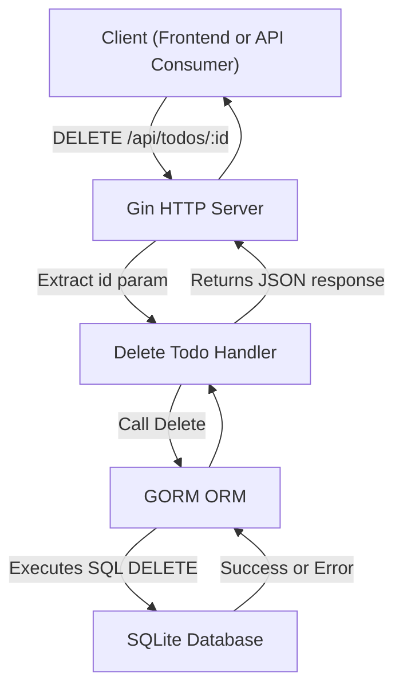

# DELETE /api/todos/:id

The `DELETE /api/todos/:id` endpoint allows clients to remove a specific Todo item from the backend database by its unique identifier. This is part of the RESTful API provided by the backend server for managing Todo items.

---

## Table of Contents

- [Overview](#overview)
- [Request](#request)
  - [HTTP Method](#http-method)
  - [URL Parameters](#url-parameters)
- [Response](#response)
  - [Success](#success)
  - [Error Handling](#error-handling)
- [Example Usage](#example-usage)
- [Integration Details](#integration-details)
- [System Interaction Diagram](#system-interaction-diagram)

---

## Overview

This endpoint enables clients to delete a Todo by specifying its `id` in the URL path. When a request is received, the backend locates the Todo entry in the SQLite database via GORM ORM and deletes it. It then returns a confirmation response.

The endpoint follows RESTful conventions using the HTTP DELETE method and is part of a simple Todo backend built with [Gin](https://github.com/gin-gonic/gin) and [GORM](https://gorm.io/).


## Request

### HTTP Method

- `DELETE`

### URL Parameters

| Parameter | Type   | Description                    | Required |
|-----------|--------|-------------------------------|----------|
| `id`      | string | Unique identifier of the Todo | Yes      |

Example URL:

```
DELETE /api/todos/123
```


## Response

### Success

- **Status Code:** `200 OK`
- **Content:** JSON object indicating successful deletion. Usually an empty body or confirmation message.

### Error Handling

If the Todo item is not found or an invalid `id` is provided, the server may respond with:

- **Status Code:** `404 Not Found`
- **Content:** JSON error message indicating the resource does not exist.


## Example Usage

```bash
curl -X DELETE http://localhost:8080/api/todos/123
```

```go
// Handler snippet from backend (Go):
func deleteTodoHandler(c *gin.Context) {
    id := c.Param("id")

    // Delete todo item by ID from DB
    if err := db.Delete(&models.Todo{}, id).Error; err != nil {
        c.JSON(404, gin.H{"error": "Todo not found"})
        return
    }

    c.JSON(200, gin.H{"message": "Todo deleted successfully"})
}
```


## Integration Details

- **Backend:** Implemented in Go using the Gin web framework.
- **ORM:** Uses GORM to interact with a SQLite database.
- **Path Parameter:** The `id` parameter is extracted from the URL using Gin's `c.Param`.
- **Data Model:** Todo model is defined in `models.Todo` which embeds `gorm.Model` for schema and ID.
- **Dependencies:**
  - `github.com/gin-gonic/gin` for HTTP routing and middleware.
  - `gorm.io/gorm` and `gorm.io/driver/sqlite` for database access.
- **Middleware:** The server is configured to use CORS middleware for cross-origin requests.

The delete operation directly deletes based on the URL-provided `id`, ensuring a RESTful, stateless interaction.


## System Interaction Diagram




## Source

- See the implementation in the backend server source file: [main.go](/main.go)

<Note>Ensure the client has correct authorization and sends valid requests to avoid unintended data loss.</Note>