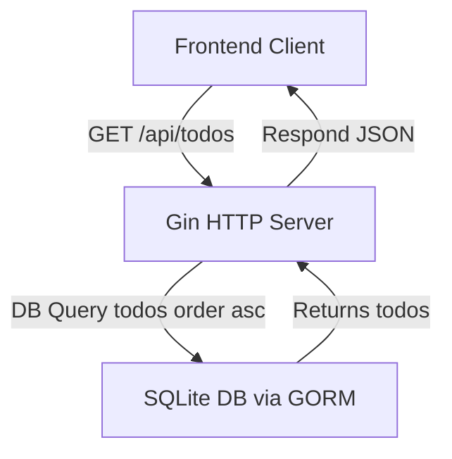

# Overview

The `GET /api/todos` endpoint retrieves the list of all todo items stored in the backend server. This endpoint returns the todos ordered by their designated sequence (`order` property) in ascending order, allowing clients to render the tasks in the intended order.

This API operation is fundamental for displaying the user's current todo list within the application frontend or any connected clients.

---

## Table of Contents

- [Endpoint Description](#endpoint-description)
- [Request](#request)
- [Response](#response)
- [Example](#example)
- [Integration Details](#integration-details)
- [Related Links](#related-links)

---

## Endpoint Description

The `GET /api/todos` endpoint fetches all todo items as an array of objects.

Each todo object typically contains:
  - `id`: Unique identifier of the todo
  - `title`: The descriptive text of the todo
  - `completed`: Boolean indicating completion status
  - `order`: Integer representing the position in the todo list

The data is sorted by `order` ascending to respect the user's custom ordering.


## Request

This is a straightforward `GET` request with no query parameters or request body required.

```
GET /api/todos
Host: your.backend.server
Accept: application/json
```

## Response

The response is a JSON array of todo objects, each representing a task with its metadata.

```json
[
  {
    "id": 1,
    "title": "Learn Gin framework",
    "completed": false,
    "order": 1
  },
  {
    "id": 2,
    "title": "Build todo app backend",
    "completed": true,
    "order": 2
  }
]
```

- `200 OK` on success.
- The todos are guaranteed to be sorted by their `order` field.


## Example

Here is a minimal example demonstrating how a client might fetch the todos using JavaScript `fetch`:

```js
// Fetch todos and log results
fetch('/api/todos')
  .then(response => response.json())
  .then(todos => {
    console.log('Todos:', todos);
    // Render todos on UI here
  })
  .catch(error => console.error('Error fetching todos:', error));
```


## Integration Details

This endpoint is implemented in the backend `main.go` server using Gin and GORM.

- **Database Layer:** Uses GORM ORM to query the SQLite database.
- **Sorting:** Queries todos with `.Order("order asc")` to ensure correct sequence.
- **Response:** Returns the list as JSON via Gin's `c.JSON` function.
- **Dependencies:**
  - `gorm.io/gorm` for DB operations
  - `github.com/gin-gonic/gin` for HTTP routing and response


### System Interaction Diagram




### Important Points

- The endpoint does not support filtering or pagination; it returns all todos.
- The ordering must be maintained by consistent management of the `order` field on create/update.
- Integration with frontend apps (like React) is direct and simple, expecting an ordered array.


## Related Links

- Implementation source in [`main.go`](./main.go#LXX-LXX) - locate the `GET /api/todos` handler
- Frontend usage example in [`App.jsx`](./frontend/src/App.jsx#LXX-LXX) where the todos are fetched
- Backend data model reference in [`models.Todo`](./todos-app/models/todo.go)

---

For more details on related endpoints, see [POST /api/todos](../POST%20/api/todos) to add todos or [PUT /api/todos/reorder](../PUT%20/api/todos/reorder) to reorder.
