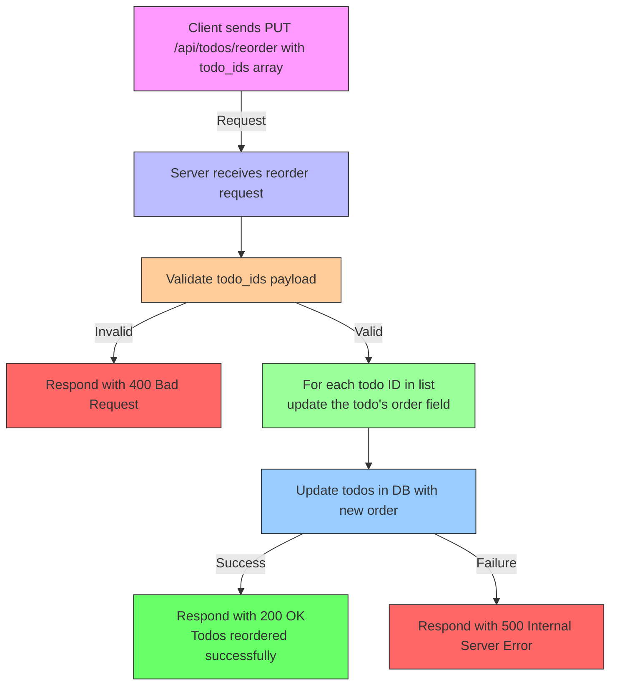

# Overview

The `PUT /api/todos/reorder` endpoint updates the order of todo items based on a new list of todo IDs provided by the client. This endpoint is essential for persisting user-driven reorder actions performed on the frontend, ensuring that the new sequence is saved on the backend database.

By accepting a list of todo IDs in the desired order, the server updates the `order` attribute of each todo to reflect the new positions.

---

## Table of Contents

- [Request](#request)
- [Response](#response)
- [Usage Example](#usage-example)
- [Integration Details](#integration-details)
- [Mermaid Flow Diagram](#mermaid-flow-diagram)
- [Source Code](#source-code)

---

## Request

### URL

```
PUT /api/todos/reorder
```

### Headers

| Header        | Description                     |
| ------------- | -------------------------------|
| Content-Type  | Must be `application/json`      |

### Body

The request expects a JSON object with a single property, `todo_ids`, which is an array of numeric Todo IDs in the desired new order.

```json
{
  "todo_ids": [3, 1, 4, 2]
}
```

- `todo_ids`: Array of todo item IDs in the specific sequence that the client wants todos to be ordered.

---

## Response

The server responds with a JSON payload confirming the reorder operation was successful.

### Success (200 OK)

```json
{
  "message": "Todos reordered successfully"
}
```

### Failure

- If the request body is malformed or empty, the server returns `400 Bad Request` with an error message.
- If any internal server error occurs during update, a `500 Internal Server Error` is returned.

---

## Usage Example

### Curl Example

```bash
curl -X PUT "/api/todos/reorder" \
     -H "Content-Type: application/json" \
     -d '{"todo_ids": [5, 2, 4, 1]}'
```

### JavaScript (Axios) Example

```javascript
import axios from 'axios';

const newOrder = [10, 3, 7, 1];

axios.put('/api/todos/reorder', { todo_ids: newOrder })
  .then(response => {
    console.log(response.data.message);
  })
  .catch(error => {
    console.error('Failed to reorder todos:', error);
  });
```

---

## Integration Details

- **Backend:** The endpoint is implemented using the Gin HTTP web framework and GORM ORM for SQLite database operations.
  - The server expects a JSON payload with the ordered array of todo IDs.
  - For each ID, it updates the corresponding todo's `order` field in the database.
  - The `order` column determines the display order in todos listing.

- **Frontend:** Typically used in conjunction with drag-and-drop UI elements that allow users to reorder todo items.
  - After reordering on the client side, the new order of IDs is sent to this endpoint.
  - The backend saves the new order, so the next fetch reflects the updated sequence.

- **Dependencies:**
  - `gin-gonic/gin` for routing and handling HTTP requests.
  - `gorm.io/gorm` and `gorm.io/driver/sqlite` for database access and migration.
  - `todos-app/models` where the Todo model is defined.

- **Responsibilities:**
  - Parse the incoming JSON body and validate the todo IDs.
  - Use a database transaction or a loop of updates to assign new order values incrementally.
  - Return an appropriate HTTP response signaling success or failure.

---

## Mermaid Flow Diagram



---

## Source Code

You can view the implementation of this endpoint in the backend server code:

- [main.go: PUT /api/todos/reorder endpoint implementation](./main.go#LXX)  
  *(replace `LXX` with the line number of reorder handler)*

This handler reads the JSON payload, iterates over the todo IDs, and updates their `order` fields in the underlying SQLite database, ensuring data consistency with GORM.

---

<Note>Make sure the todo IDs provided exist in the database to prevent errors during update operations.</Note>