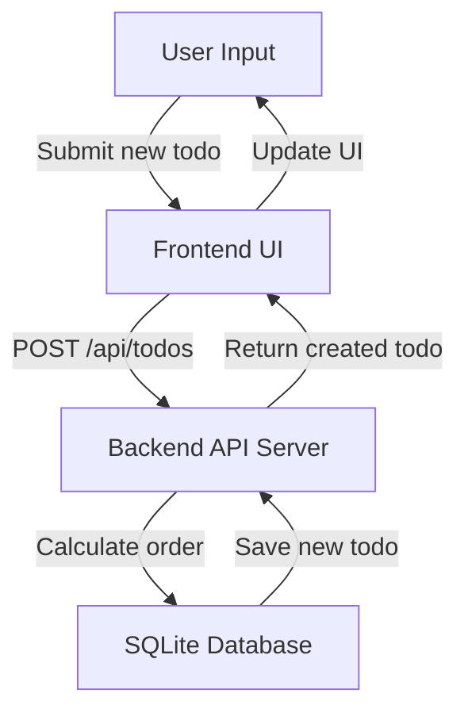

# Adding a Todo

Adding a new todo item is a core feature of the Futuristic Todo App that allows users to create and manage tasks dynamically. This process involves sending data from the frontend user interface to the backend API, where the new todo is persisted in the database with an assigned order value.

---

## Table of Contents

- [Introduction](#introduction)
- [How Adding a Todo Works](#how-adding-a-todo-works)
- [Frontend Integration](#frontend-integration)
- [Backend API Endpoint](#backend-api-endpoint)
- [Example Code](#example-code)
- [System Interaction Diagram](#system-interaction-diagram)
- [Related Source Files](#related-source-files)

---

## Introduction

Adding a todo enables users to expand their task list by creating new todo items. Each todo typically consists of a title and attributes like completion status and order within the list. The system automatically assigns an order to the new todo so that todos can be displayed in a specific sequence.

This operation involves two main parts:

- The frontend UI component that captures user input and sends a request.
- The backend API that receives the request, stores the new todo, and responds with the created item.

---

## How Adding a Todo Works

1. The user types a todo title into the input field and submits the form.
2. The frontend calls the POST `/api/todos` endpoint sending the new todo details in JSON.
3. The backend validates the input and calculates the next order number for the todo.
4. The backend saves the todo in the database.
5. The backend returns the created todo object.
6. The frontend updates its local state to display the new todo immediately.

This flow ensures the UI reflects the most current todo list state and maintains correct ordering.

---

## Frontend Integration

In the React frontend, the main component uses an async function that:

- Handles form submission.
- Sends a POST request to the backend API with the new todo title.
- Updates the local todo list state with the response.

Here is a simplified snippet:

```jsx
import axios from 'axios';
import React, { useState } from 'react';

function AddTodoForm({ onTodoAdded }) {
  const [newTodo, setNewTodo] = useState('');

  const addTodo = async (e) => {
    e.preventDefault();
    if (!newTodo.trim()) return; // Avoid empty todos

    try {
      // Send POST request to backend to create the new todo
      const response = await axios.post('/api/todos', { title: newTodo });

      // Notify parent component to update todo list
      onTodoAdded(response.data);

      // Clear input
      setNewTodo('');
    } catch (error) {
      console.error('Failed to add todo:', error);
    }
  };

  return (
    <form onSubmit={addTodo}>
      <input
        type="text"
        value={newTodo}
        onChange={(e) => setNewTodo(e.target.value)}
        placeholder="Add new todo"
        aria-label="New todo title"
      />
      <button type="submit">Add</button>
    </form>
  );
}

export default AddTodoForm;
```

This component connects directly to the backend API and ensures the app UI remains in sync.

---

## Backend API Endpoint

The backend exposes the following endpoint to add new todos:

```http
POST /api/todos
Content-Type: application/json

{
  "title": "New todo task"
}
```

### Behavior

- Calculates the new todo's order by counting existing todos.
- Saves the todo with `title` and `order`.
- Returns the full todo object including its unique ID and default fields.

### Example Handler Snippet (Go / Gin Framework)

```go
r.POST("/api/todos", func(c *gin.Context) {
  var todo models.Todo
  if err := c.ShouldBindJSON(&todo); err != nil {
    c.JSON(400, gin.H{"error": "Invalid JSON"})
    return
  }

  var count int64
  db.Model(&models.Todo{}).Count(&count) // Get current todo count

  todo.Order = int(count) + 1             // Assign next order
  if err := db.Create(&todo).Error; err != nil {
    c.JSON(500, gin.H{"error": "Failed to save todo"})
    return
  }

  c.JSON(200, todo)                       // Return created todo
})
```

This endpoint ensures todos are stored consistently and ready for retrieval and display.

---

## Example Code

### Adding a Todo with Fetch API (vanilla JS example)

```js
async function addTodoItem(title) {
  if (!title.trim()) return;

  const response = await fetch('/api/todos', {
    method: 'POST',
    headers: { 'Content-Type': 'application/json' },
    body: JSON.stringify({ title }),
  });

  if (!response.ok) {
    console.error('Failed to add todo');
    return null;
  }

  const todo = await response.json();
  return todo; // Newly created todo object
}
```

---

## System Interaction Diagram



---

## Related Source Files

- Backend API handling new todos: [`main.go`](https://github.com/your-repo/path/main.go#LXX)
- Frontend AddTodo UI and logic: [`frontend/src/App.jsx`](https://github.com/your-repo/path/frontend/src/App.jsx#LXX)

These files contain the exact implementation of the adding todo functionality.

---

<Note>Remember to validate user input both on frontend and backend to avoid invalid or empty todos.</Note>

This documentation covers the end-to-end flow for adding todos, from user input capture to API persistence and UI update, showing integrations with both backend and frontend components.