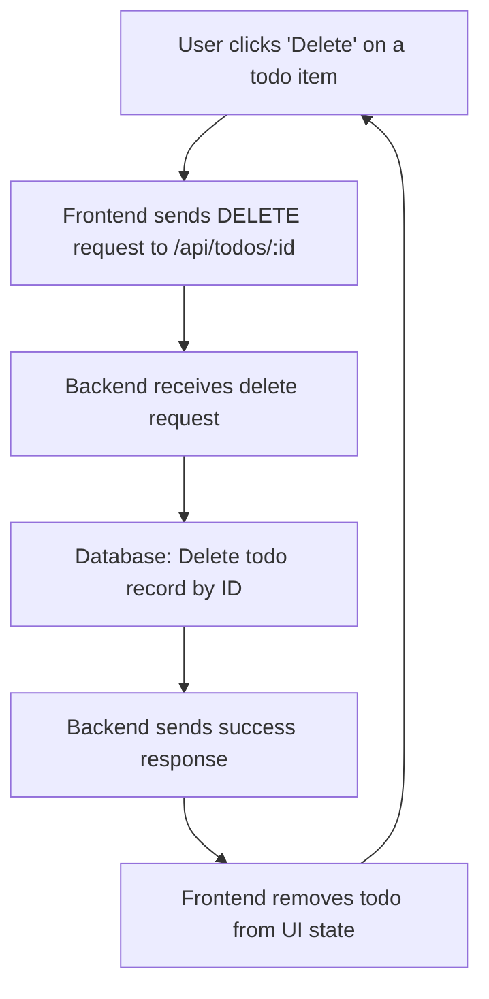

# Deleting a Todo

Deleting a todo item is a fundamental operation in managing your todo list. This process involves sending a request to the backend API, which then removes the specified todo item from the persistent database. The frontend reacts to this change by updating the user interface accordingly.

---

## Table of Contents

- [Overview](#overview)
- [API Endpoint: DELETE /api/todos/:id](#api-endpoint-delete-apitodosid)
- [Frontend Integration](#frontend-integration)
- [Example Code](#example-code)
- [System Interaction Flow](#system-interaction-flow)

---

## Overview

The deletion functionality supports the removal of a single todo task identified by its unique ID. This endpoint and corresponding frontend function help keep the todo list synchronized between the client and backend.

Key points:

- The backend expects the todo ID as a URL parameter.
- The item identified by this ID is deleted from the SQLite database.
- The frontend triggers the deletion and updates local state to keep the UI consistent.

This operation ensures that users can remove completed or unwanted tasks effortlessly.

## API Endpoint: DELETE /api/todos/:id

This REST API endpoint handles the deletion of a todo item by its ID.

### Request

- **Method:** DELETE
- **URL:** `/api/todos/:id`
- **URL Parameter:**
  - `id` (string or number): Unique identifier of the todo to delete

### Response

- **Status:** 200 OK upon successful deletion
- **Body:** JSON object with success or error details

### Backend Handling (Excerpt)

```go
// DELETE /api/todos/:id
r.DELETE("/api/todos/:id", func(c *gin.Context) {
  id := c.Param("id")
  // Delete the todo by ID from the database
  db.Delete(&models.Todo{}, id)
  c.JSON(200, gin.H{"status": "deleted"})
})
```

The backend uses GORM's `Delete` method to remove the todo entry from the database. The handler then returns a simple success JSON message.

## Frontend Integration

The frontend communicates with this endpoint to delete a todo item. It uses an HTTP DELETE request to the API, passing the todo's ID in the URL.

Upon successful deletion, the frontend updates the displayed todo list by filtering out the deleted item from the local state, avoiding the need for a full refetch.

## Example Code

### Frontend - Deleting a Todo Using Axios (React)

```jsx
import axios from 'axios';
import React, { useState } from 'react';

function deleteTodo(id, todos, setTodos) {
  // Send DELETE request to remove todo by id
  axios.delete(`/api/todos/${id}`)
    .then(() => {
      // Update local todos state by filtering out deleted todo
      setTodos(todos.filter(todo => todo.id !== id));
    })
    .catch(error => {
      console.error('Failed to delete todo:', error);
    });
}

// Usage in a component
// const [todos, setTodos] = useState([]);
// deleteTodo(3, todos, setTodos);
```

### Backend - Gin Framework Endpoint for Deletion

```go
r.DELETE("/api/todos/:id", func(c *gin.Context) {
  id := c.Param("id")
  // Delete the todo with the specified ID
  if err := db.Delete(&models.Todo{}, id).Error; err != nil {
    c.JSON(500, gin.H{"error": "Failed to delete todo"})
    return
  }
  c.JSON(200, gin.H{"status": "deleted"})
})
```

## System Interaction Flow



## Integration Details

- **Backend**
  - Implemented using [Gin Web Framework](https://github.com/gin-gonic/gin) for routing and HTTP handling.
  - Uses [GORM](https://gorm.io) ORM for database operations.
  - The todo model is defined in `models.Todo` with SQLite as the database backend.

- **Frontend**
  - React is used for UI components.
  - Axios handles HTTP requests.
  - Delete functionality updates React state to reflect the change immediately.

- **API Contract**
  - The server expects the todo ID as a RESTful URL parameter.
  - The HTTP DELETE method is used to signal removal.

For the full backend source, see: [main.go](/main.go)

For the frontend deletion logic, see: [App.jsx](/frontend/src/App.jsx)

---

<Info>Deleting a todo is a straightforward but critical part of keeping your todo list clean and relevant. Ensure proper error handling on both backend and frontend to inform users of any issues during deletion.</Info>
