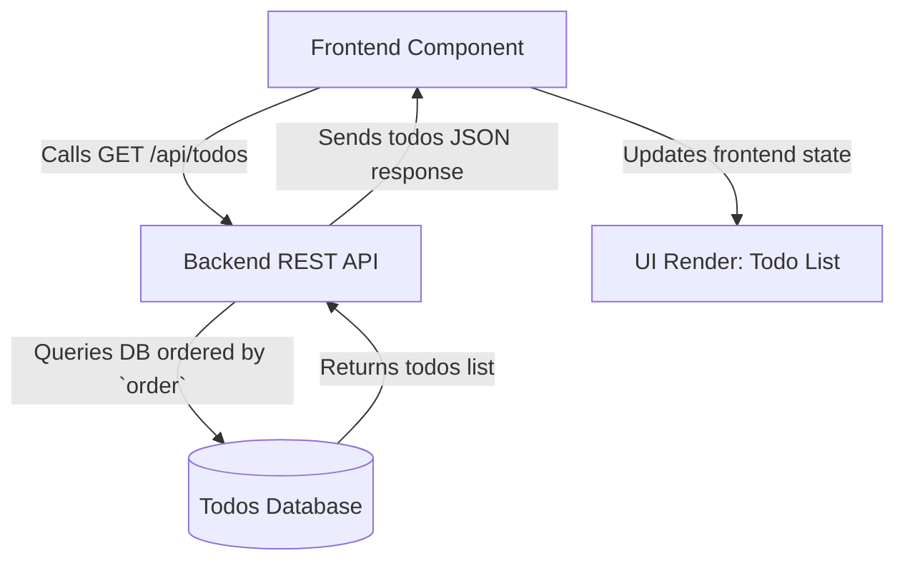

# Fetching Todos

Fetching todos is a fundamental operation in the frontend of the Todos application. It involves retrieving the complete list of todo items from the backend server, ordered by their priority or custom order value, so they can be displayed, manipulated, and updated in the user interface.

---

## Table of Contents

- [Overview](#overview)
- [How Fetching Works](#how-fetching-works)
- [Code Example](#code-example)
- [Integration Details](#integration-details)
- [Flow Diagram](#flow-diagram)

---

## Overview

The fetching of todos enables the frontend to stay synchronized with the backend data store. The backend exposes a REST API endpoint (`GET /api/todos`) that returns an array of todo items sorted by their `order` property in ascending order. This ensures todos are presented to users in the correct sequence.

The frontend calls this endpoint using HTTP, processes the JSON response, and updates its local state to reflect the current list of todos.

## How Fetching Works

1. **Request:** The frontend issues a `GET` request to `/api/todos`.
2. **Backend Processing:** The backend queries its database, ordering todos by their explicit `order` field.
3. **Response:** The list of todos is sent back as JSON.
4. **Frontend Update:** The frontend updates its state with the fetched todos, triggering a UI re-render.

This flow is orchestrated by a React component using hooks like `useEffect` to perform the fetch when the component mounts.

## Code Example

```jsx
import { useState, useEffect } from "react";
import axios from "axios";

function TodosList() {
  const [todos, setTodos] = useState([]);

  // Fetch todos from backend on component mount
  useEffect(() => {
    const fetchTodos = async () => {
      try {
        const response = await axios.get("/api/todos");
        setTodos(response.data); // Update state with fetched todos
      } catch (error) {
        console.error("Error fetching todos:", error);
      }
    };

    fetchTodos();
  }, []); // Empty dependency array = runs once on mount

  return (
    <ul>
      {todos.map(todo => (
        <li key={todo.id}>{todo.title}</li>
      ))}
    </ul>
  );
}

export default TodosList;
```

*Comments:*
- The `axios.get` call fetches the todos from the API endpoint.
- On success, the todos array is stored in React local state.
- Errors in fetching are caught and logged.

## Integration Details

- **Backend Endpoint:** `GET /api/todos`
  - Defined in [main.go](/main.go)
  - Returns todos ordered by the `order` property.

- **Frontend Component:** Usually invoked inside a main UI React component, such as `App.jsx` ([source](frontend/src/App.jsx))
  - Uses `axios` for HTTP communication.
  - Updates UI reactively by managing todos in state.

- **Dependencies:**
  - **axios:** HTTP client for requests.
  - **React Hooks:** `useState` and `useEffect` to handle side effects and state.

- **Touchpoints:**
  - Network call to the backend server.
  - React rendering triggered by state update.

- **Responsibilities:**
  - Keep UI synchronized with the backend data.
  - Handle potential fetch failures gracefully.

## Flow Diagram



---

For more details on the backend API endpoint handling, see the [GET /api/todos endpoint documentation](main.go:/api/todos:GET).

To understand how fetched todos are displayed and managed in the frontend, refer to the [App.jsx source](frontend/src/App.jsx).
