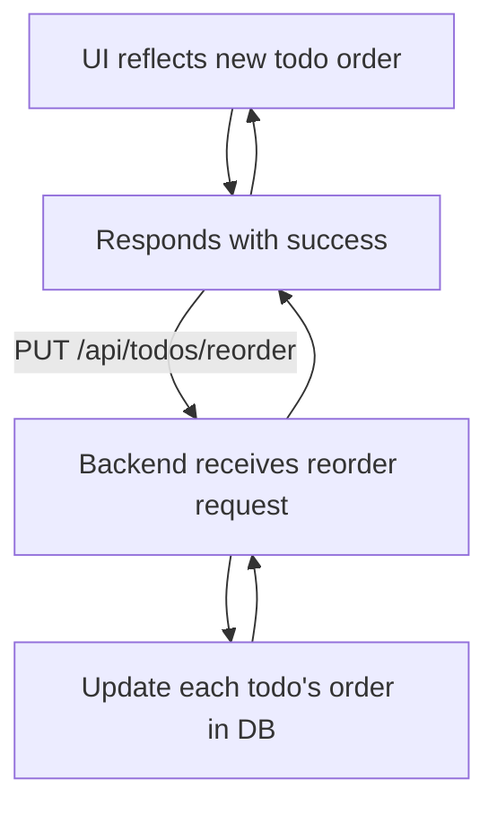

# Reordering Todos

Reordering todos allows users to change the order in which tasks appear in the list, reflecting priority or workflow preferences. This functionality synchronizes the frontend drag-and-drop interface with the backend data store so that the todo order persists across sessions.

## Table of Contents
- [Overview](#overview)
- [How Reordering Works](#how-reordering-works)
- [Frontend Integration](#frontend-integration)
- [Backend API Endpoint](#backend-api-endpoint)
- [Example Usage](#example-usage)
- [Architecture Diagram](#architecture-diagram)

---

## Overview

Reordering todos is a key feature in dynamic task list applications allowing manual adjustment of task priority or sequence. The frontend presents a draggable UI component, while the backend updates the order values in persistent storage.

In this system, reordering is:

- Initiated on the client side via drag-and-drop UI powered by Framer Motion's Reorder components.
- Communicated to the backend via a PUT API call to `/api/todos/reorder` with the new ordered list of todo IDs.
- Processed in the backend by updating each todo's `order` property according to its position in the new order.

This ensures the order is consistent and remembered for the user.

---

## How Reordering Works

1. **User Action:** The user drags and drops todo items to rearrange them in the UI.
2. **Frontend State Update:** The new ordering of todos is captured locally as a list of todo objects.
3. **API Request:** The frontend sends a PUT request to `/api/todos/reorder` with a JSON payload containing the ordered list of todo IDs.
4. **Backend Processing:** The backend iterates over the todo IDs, updating the `order` index on each todo record.
5. **Persistent Storage:** Updated todo order is saved in the database.
6. **Response:** The backend confirms success, allowing the frontend to reflect the new order.

---

## Frontend Integration

The reordering UI is implemented in React with the help of [Framer Motion](https://www.framer.com/motion/) for smooth drag and reorder animations.

- `Reorder.Group` wraps the entire list enabling drag-and-drop sorting.
- `Reorder.Item` wraps each todo item, making it draggable.

When reordering completes, an event handler sends the updated order to the backend:

```jsx
// React handler for completion of drag & drop
async function handleReorder(newTodos) {
  const todoIDs = newTodos.map(todo => todo.id);
  await axios.put('/api/todos/reorder', { TodoIDs: todoIDs });
  setTodos(newTodos); // Update state locally
}
```

This API call ensures backend state persistence.

---

## Backend API Endpoint

### `PUT /api/todos/reorder`

Accepts a JSON body with an array of todo IDs representing the new order.

**Request Body:**

```json
{
  "TodoIDs": [3, 1, 2, 5]
}
```

**Functionality:**

- Validates the order array.
- Iterates over IDs, updating each todo's `order` field matching the array index.
- Saves changes in the database.
- Returns HTTP 200 on success.

**Example implementation snippet in Go:**

```go
var reorderRequest struct { TodoIDs []uint }
if err := c.ShouldBindJSON(&reorderRequest); err != nil {
  c.JSON(400, gin.H{"error": "Invalid request payload"})
  return
}

for index, id := range reorderRequest.TodoIDs {
  db.Model(&models.Todo{}).Where("id = ?", id).Update("order", index)
}

c.JSON(200, gin.H{"status": "order updated"})
```

[See full backend code](/main.go)

---

## Example Usage

```jsx
import { Reorder, motion } from 'framer-motion';
import axios from 'axios';

function TodoList() {
  const [todos, setTodos] = React.useState([]);

  // Called when user finishes drag and drop
  const handleReorder = async (newOrder) => {
    try {
      const todoIDs = newOrder.map(todo => todo.id);
      await axios.put('/api/todos/reorder', { TodoIDs: todoIDs });
      setTodos(newOrder);
    } catch (error) {
      console.error('Failed to update order:', error);
    }
  };

  return (
    <Reorder.Group axis="y" values={todos} onReorder={handleReorder}>
      {todos.map(todo => (
        <Reorder.Item key={todo.id} value={todo}>
          <motion.div>
            {todo.title}
          </motion.div>
        </Reorder.Item>
      ))}
    </Reorder.Group>
  );
}
```

This example shows the essential connection between the UI component and the backend reorder API.

---

## Architecture Diagram



---

## Integration Details

- **Frontend Dependencies:** React, Axios, Framer Motion
- **Backend Dependencies:** Gin (HTTP server), GORM (ORM), SQLite (database)

**Key touchpoints:**
- Frontend dispatches reorder requests after user interaction.
- Backend endpoint `/api/todos/reorder` ensures atomic and consistent order updates.
- The `order` field in todo records is crucial for sorting and persistence.

This design cleanly separates concerns:
- Frontend focuses on user experience and UI state.
- Backend handles data integrity and persistence.

For the full backend source code, see [main.go](/main.go).


---

## See Also
- [Fetching Todos](/frontend/src/App.jsx:/api/todos:GET)
- [Adding a Todo](/frontend/src/App.jsx:/api/todos:POST)
- [Deleting a Todo](/frontend/src/App.jsx:/api/todos/{id}:DELETE)

