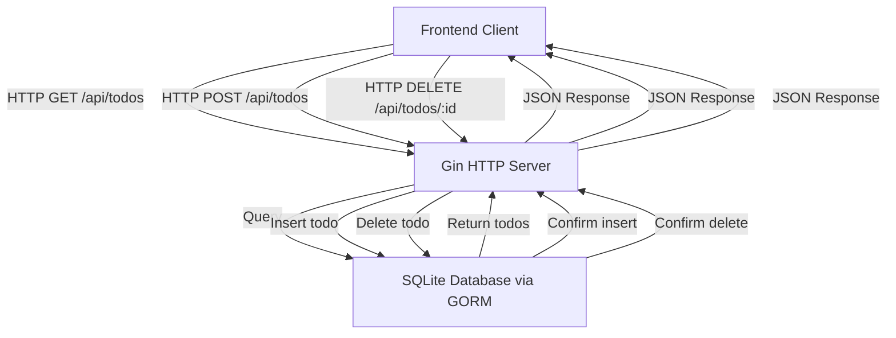

# Backend Architecture

The backend of the Futuristic Todo App is implemented using the [Gin](https://github.com/gin-gonic/gin) web framework along with the [GORM](https://gorm.io/) ORM library. Its primary role is to provide a RESTful API for managing Todo items, including creating, retrieving, and deleting tasks stored in an SQLite database. The architecture is designed for simplicity, scalability, and ease of integration with the React frontend.

---

## Table of Contents

- [Overview](#overview)
- [Core Components](#core-components)
- [API Endpoints](#api-endpoints)
- [Database Integration](#database-integration)
- [Middleware & Configuration](#middleware--configuration)
- [Interaction Flow](#interaction-flow)
- [Code Example](#code-example)
- [System Integration](#system-integration)

---

## Overview

The backend is a standalone HTTP server written in Go. It:

- Connects to an SQLite database using GORM.
- Uses Gin to handle HTTP requests.
- Automatically migrates the database schema for Todo items.
- Enables CORS middleware to allow frontend communication.
- Exposes RESTful endpoints for operations on Todo records.

This modular design separates concerns, with the backend focusing solely on data management and API delivery, keeping the frontend free to handle UI/UX.

---

## Core Components

### Gin Web Framework
- Provides fast HTTP routing and middleware support.
- Manages incoming client requests to REST endpoints.

### GORM ORM
- Abstracts database interactions.
- Manages models, migrations, and queries on SQLite.

### SQLite
- Lightweight, file-based embedded database.
- Stores persistent Todo data.

### CORS Middleware
- Configured with default policies to enable cross-origin requests.

---

## API Endpoints

The backend provides the following endpoints:

| Endpoint         | HTTP Method | Description                      |
|------------------|-------------|----------------------------------|
| `/api/todos`     | GET         | Retrieve all todo items.         |
| `/api/todos`     | POST        | Create a new todo item.          |
| `/api/todos/:id` | DELETE      | Delete a todo item by ID.        |

Each endpoint responds with JSON data and appropriate HTTP status codes.

---

## Database Integration

The `Todo` model integrates with GORM's base `Model`, inheriting fields like ID, CreatedAt, UpdatedAt, and DeletedAt. Database migration is performed automatically during startup to ensure the schema is up-to-date.

Example: Database migration call

```go
err = db.AutoMigrate(&models.Todo{}) // Auto-migrate Todo schema
if err != nil {
  log.Fatal("Migration failed", err)
}
```

---

## Middleware & Configuration

The backend sets up CORS with default configuration allowing frontend-origin access, enabling secure cross-origin HTTP requests.

Middleware usage example:

```go
config := cors.DefaultConfig()
r.Use(cors.New(config))
```

This ensures the frontend React app can communicate with the API without browser CORS issues.

---

## Interaction Flow



---

## Code Example

A concise excerpt from the backend's main server setup:

```go
package main

import (
  "log"
  "todos-app/models"

  "github.com/gin-contrib/cors"
  "github.com/gin-gonic/gin"
  "gorm.io/driver/sqlite"
  "gorm.io/gorm"
)

func main() {
  // Connect to SQLite database
  db, err := gorm.Open(sqlite.Open("todos.db"), &gorm.Config{})
  if err != nil {
    log.Fatal("Failed to connect to database", err)
  }

  // Auto migrate Todo schema
  if err := db.AutoMigrate(&models.Todo{}); err != nil {
    log.Fatal("AutoMigration failed", err)
  }

  // Initialize Gin engine
  r := gin.Default()

  // Setup CORS middleware
  config := cors.DefaultConfig()
  r.Use(cors.New(config))

  // Define REST endpoints
  r.GET("/api/todos", func(c *gin.Context) {
    var todos []models.Todo
    db.Find(&todos)
    c.JSON(200, todos)
  })

  r.POST("/api/todos", func(c *gin.Context) {
    var todo models.Todo
    if err := c.ShouldBindJSON(&todo); err == nil {
      db.Create(&todo)
      c.JSON(201, todo)
    } else {
      c.JSON(400, gin.H{"error": err.Error()})
    }
  })

  r.DELETE("/api/todos/:id", func(c *gin.Context) {
    id := c.Param("id")
    db.Delete(&models.Todo{}, id)
    c.Status(204)
  })

  // Run server on port 8080
  r.Run(":8080")
}
```

See the full source file: [main.go](main.go)

---

## System Integration

The backend is a central system component that exposes a clean REST API consumed by the React frontend application. Key integration points:

- **Database Layer:** Uses GORM for ORM-based interaction with SQLite, abstracting SQL complexity.
- **HTTP Server:** Gin routes client requests to handlers, enforces middleware policies (e.g., CORS).
- **Frontend Communication:** Allows frontend to fetch, add, and delete todos with JSON payloads.

Dependencies:
- `github.com/gin-gonic/gin` for HTTP server and routing.
- `gorm.io/gorm` and `gorm.io/driver/sqlite` for ORM and SQLite driver.
- `github.com/gin-contrib/cors` for handling Cross-Origin Resource Sharing.

This architecture allows for easy expansion — additional endpoints, authentication, or alternative databases can be integrated with minimal disruption.

<Info>
The backend server runs independently and listens on port 8080 by default. Ensure the frontend API requests match this endpoint for seamless operation.
</Info>
