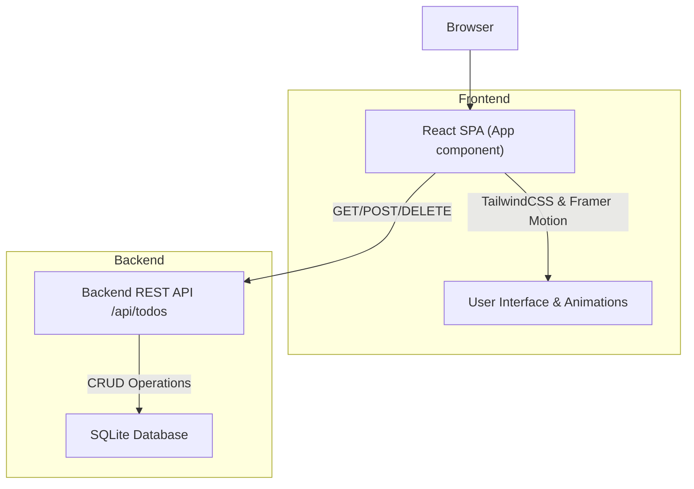

# Frontend Architecture

This document provides an in-depth overview of the frontend architecture for the Futuristic Todo App. It details the core technologies used, the key components of the UI, integration points with the backend, and design decisions driving the user experience.

---

## Table of Contents

- [Overview](#overview)
- [Core Technologies](#core-technologies)
- [Component Structure](#component-structure)
- [State Management & Data Flow](#state-management--data-flow)
- [API Interaction](#api-interaction)
- [Styling and Animations](#styling-and-animations)
- [Integration with Backend](#integration-with-backend)
- [Frontend Architecture Diagram](#frontend-architecture-diagram)

---

## Overview

The frontend of the Futuristic Todo App is built using React, providing a responsive, modern user interface to interact with todo items. It is responsible for rendering the todo list, handling user inputs to add or delete todos, and visually updating the UI based on backend data.

This frontend app is designed as a single-page application (SPA) and serves as the user-facing client that communicates with the backend REST API to manage todo items.


## Core Technologies

- **React**: The primary UI library used for building component-based UIs with hooks for state and lifecycle management.
- **Axios**: A promise-based HTTP client for making requests to the backend API.
- **Tailwind CSS**: Utility-first CSS framework for rapid UI styling with customization support.
- **Framer Motion**: Animation library for adding smooth and engaging UI transitions.


## Component Structure

The frontend application’s core is the `App` component which:

- Manages application state including todo items and the input state for new todos.
- Fetches todos from the backend when the app loads.
- Provides functions to add and delete todos by calling respective API endpoints.
- Renders the list of todos with animated UI elements for better user experience.

Components hierarchy is simple and focused on one main root component:

```jsx
// Import React and hooks
import React, { useState, useEffect } from 'react';
import axios from 'axios';
import { motion } from 'framer-motion';

function App() {
  // State for todos
  const [todos, setTodos] = useState([]);
  const [newTodo, setNewTodo] = useState('');

  // Fetch list of todos from backend
  useEffect(() => {
    fetchTodos();
  }, []);

  // Add a new todo
  async function addTodo(e) {
    e.preventDefault();
    if(!newTodo.trim()) return;
    await axios.post('/api/todos', { title: newTodo });
    setNewTodo('');
    fetchTodos();
  }

  // Delete a todo by ID
  async function deleteTodo(id) {
    await axios.delete(`/api/todos/${id}`);
    fetchTodos();
  }

  async function fetchTodos() {
    const response = await axios.get('/api/todos');
    setTodos(response.data);
  }

  // JSX rendering omitted for brevity
}
```


## State Management & Data Flow

- The app uses React's `useState` hook to store `todos` and the current input `newTodo`.
- `useEffect` is used to trigger the initial fetch of todos on component mount.
- All CRUD operations (Create, Read, Delete) rely on asynchronous calls using Axios to the backend REST API.
- After mutations (add/delete), the todo list is re-fetched to keep UI in sync.


## API Interaction

The frontend communicates exclusively with the backend RESTful API exposed on `/api/todos` endpoints:

| HTTP Method | Endpoint        | Purpose                 |
|-------------|-----------------|-------------------------|
| GET         | `/api/todos`    | Retrieve all todos      |
| POST        | `/api/todos`    | Add a new todo          |
| DELETE      | `/api/todos/:id`| Delete a todo by ID     |

Example `fetchTodos` Axios call:

```js
axios.get('/api/todos')
  .then(res => setTodos(res.data))
  .catch(console.error);
```


## Styling and Animations

- The app uses **Tailwind CSS**, a utility-first CSS framework, for styles. This enables concise styling in JSX and ease of customization.
- **Framer Motion** provides UI animations such as fade-ins and slide effects for todos, enhancing UX.

Example animation usage:

```jsx
<motion.li 
  initial={{ opacity: 0 }} 
  animate={{ opacity: 1 }} 
  exit={{ opacity: 0 }}
>
  {todo.title}
</motion.li>
```


## Integration with Backend

- The frontend is served as static assets (HTML/CSS/JS bundle) that runs in the browser.
- It relies on the backend Go server to provide API endpoints for persistent todo data.
- Communication occurs through HTTP requests, with JSON used as the data payload format.
- The backend handles DB operations, while the frontend focuses on presenting and manipulating UI state.

---

## Frontend Architecture Diagram



---

## Source Code Links

- [App.jsx — Main React Component](./frontend/src/App.jsx)
- [index.html — Frontend HTML Entry](./frontend/index.html)
- [index.css — Global Tailwind CSS Styling](./frontend/src/index.css)
- [main.jsx — React Application Bootstrap](./frontend/src/main.jsx)

---

## Summary

The frontend architecture centers on a React SPA that provides an intuitive, animated interface to manage todo items. Leveraging React hooks, Axios, TailwindCSS, and Framer Motion, the frontend delivers an interactive experience while cleanly interfacing with the backend REST API over HTTP for data persistence.

This modular approach ensures clear separation of concerns: the frontend handles UI and user interaction while the backend manages state and database logic, communicating through defined API endpoints.
