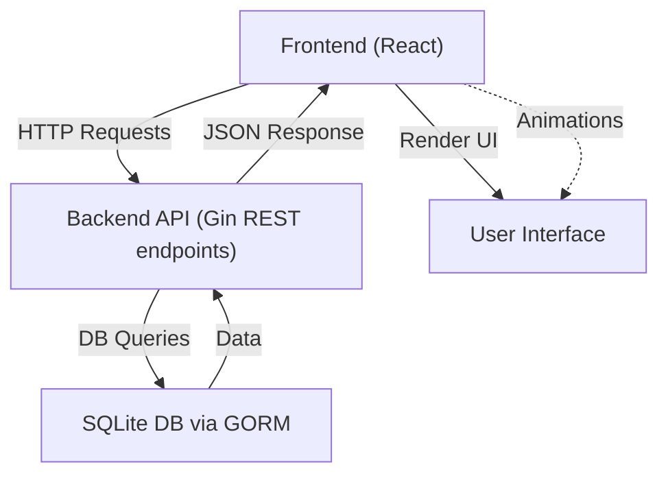

# System Architecture

This document provides a comprehensive overview of the overall system architecture of the Futuristic Todo Application, covering both the backend and frontend components, their responsibilities, integration points, and data flow. This architecture ensures a scalable, maintainable, and efficient todo list application with a RESTful API backend and a React-based frontend.

---

## Table of Contents

- [Overview](#overview)
- [Backend Architecture](#backend-architecture)
  - [Core Components](#core-components)
  - [Database Integration](#database-integration)
  - [API Endpoints](#api-endpoints)
  - [Middleware & CORS](#middleware--cors)
- [Frontend Architecture](#frontend-architecture)
  - [React Component Structure](#react-component-structure)
  - [State Management & Effects](#state-management--effects)
  - [API Communication](#api-communication)
  - [Styling & Animations](#styling--animations)
- [System Integration and Data Flow](#system-integration-and-data-flow)
- [Mermaid Diagram](#mermaid-diagram)

---

## Overview

The Futuristic Todo App is a client-server application consisting of:

- A **backend server** built in Go using the Gin web framework and GORM ORM for handling data persistence.
- A **frontend client** built with React that interacts with the backend via RESTful APIs.

This architecture allows clear separation of concerns: the backend manages data storage, business logic, and API endpoints, while the frontend handles user interaction and UI.

---

## Backend Architecture

The backend server is a REST API service written in Go. It manages todo items by exposing JSON-based HTTP endpoints.

### Core Components

- **Gin Web Framework:** Handles HTTP routing, middleware, and JSON serialization.
- **GORM ORM:** Provides an abstraction layer for database operations.
- **SQLite Database:** Used as a lightweight persistent store for todos.

### Database Integration

- Upon startup, the server uses `gorm.Open` with the SQLite driver to establish a connection.
- It automatically migrates the `Todo` model schema, which embeds `gorm.Model` for standard fields.

### API Endpoints

The backend provides three main RESTful endpoints:

| Method | Endpoint        | Description               |
|--------|-----------------|---------------------------|
| GET    | `/api/todos`    | Retrieves all todos       |
| POST   | `/api/todos`    | Creates a new todo        |
| DELETE | `/api/todos/:id`| Deletes a todo by ID      |

Each endpoint interacts with the database accordingly, handling JSON request bodies and responses.

### Middleware & CORS

- The backend uses Gin's middleware support to apply CORS configuration via `github.com/gin-contrib/cors`.
- CORS is configured to safely allow frontend origins to access the API.

### Sample Code Snippet

```go
// Initialize GORM and migrate schema
 db, err := gorm.Open(sqlite.Open("todos.db"), &gorm.Config{})
 if err != nil {
   log.Fatal(err)
 }
 db.AutoMigrate(&models.Todo{})

// Setup Gin engine and CORS
 r := gin.Default()
 config := cors.DefaultConfig()
 config.AllowAllOrigins = true
 r.Use(cors.New(config))

// Define GET endpoint
 r.GET("/api/todos", func(c *gin.Context) {
   var todos []models.Todo
   db.Find(&todos)
   c.JSON(http.StatusOK, todos)
 })
```

[source code](main.go)

---

## Frontend Architecture

The frontend is a React app designed with modern UI principles and integrates tightly with the backend API.

### React Component Structure

- The top-level component `App` manages the main todo list logic.
- Components use React hooks for state (`useState`) and side effects (`useEffect`).

### State Management & Effects

- The todo list is stored in a state array.
- Effects trigger fetching the current todo list from the backend at mount.

### API Communication

- Uses `axios` for HTTP requests to the backend REST endpoints.
- Supports fetching, adding, and deleting todos by calling respective API routes.

### Styling & Animations

- Styles are built using Tailwind CSS configured in `tailwind.config.js`.
- UI animations employ `framer-motion` for smooth transitions.

### Sample Code Snippet

```jsx
// Fetch todos on component mount
 useEffect(() => {
   axios.get('/api/todos').then(response => {
     setTodos(response.data)
   })
 }, [])

// Add new todo
 const addTodo = async (e) => {
   e.preventDefault()
   await axios.post('/api/todos', { title: newTodo })
   fetchTodos()
 }
```

[source code](frontend/src/App.jsx)

---

## System Integration and Data Flow

- The frontend React app issues HTTP requests to the backend API endpoints over REST.
- The backend receives requests and performs operations on the SQLite database through GORM.
- Responses with JSON-formatted todo items are sent back for UI rendering.

This clear separation enables modular development and future scalability (e.g., swapping databases or extending the UI).

---

## Mermaid Diagram



---

<Info>
This document references key source files that define the backend and frontend:
- Backend REST API and server setup: [main.go](main.go)
- Frontend main app component: [frontend/src/App.jsx](frontend/src/App.jsx)
- Tailwind CSS configuration: [frontend/tailwind.config.js](frontend/tailwind.config.js)

Together, these components form the full-stack Futuristic Todo Application.
</Info>