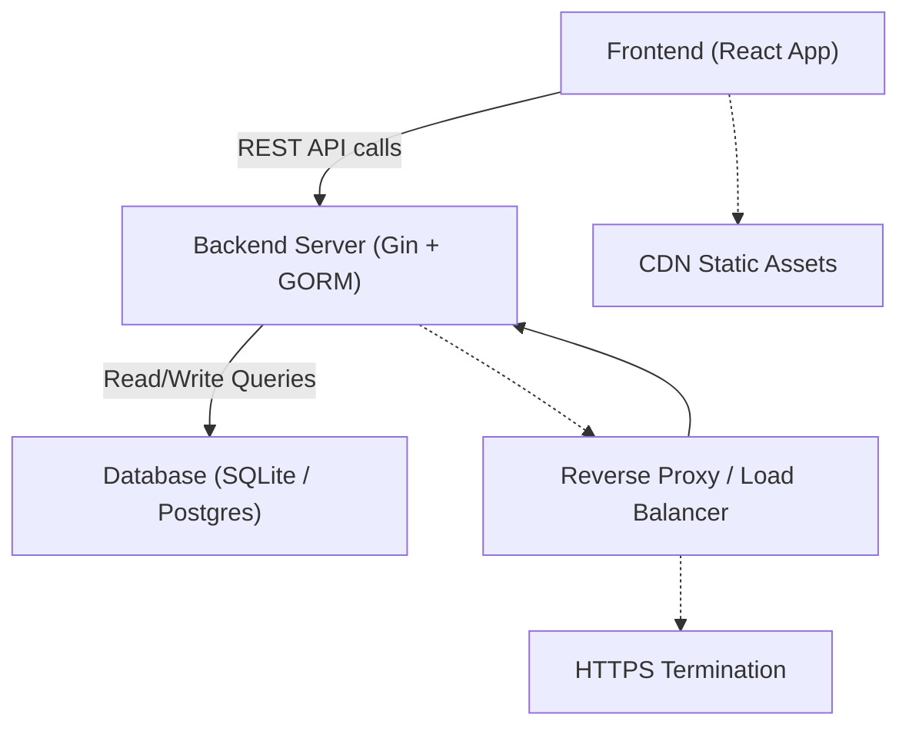

# Deployment Tips

This guide provides best practices and recommendations for deploying the Futuristic Todo App in production environments. It covers backend, frontend, and infrastructure considerations to ensure secure, scalable, and maintainable deployments.

---

## Table of Contents

- [Backend Deployment](#backend-deployment)
- [Frontend Deployment](#frontend-deployment)
- [Environment Configuration](#environment-configuration)
- [Security Considerations](#security-considerations)
- [Scaling and Performance](#scaling-and-performance)
- [Monitoring and Logging](#monitoring-and-logging)

---

## Backend Deployment

The backend is powered by a Gin web server connected to a SQLite database using GORM ORM. Follow these tips to deploy it reliably:

### 1. Use a Durable Database

- SQLite is suitable for development and light workloads but not for heavy production use or multiple concurrent users.
- For production, consider migrating to a more robust RDBMS (PostgreSQL, MySQL) supported by GORM.

### 2. Containerization

- Package the backend into a Docker container for consistency across environments.
- Example Dockerfile snippet:

```dockerfile
FROM golang:1.20-alpine
WORKDIR /app
COPY . .
RUN go build -o todo-app ./main.go
EXPOSE 8080
CMD ["./todo-app"]
```

### 3. Environment Variables

- Externalize configuration such as database connection strings, CORS origins, and server ports.
- Use `.env` files or environment variable management with orchestration platforms.

### 4. CORS Configuration

- In production, restrict CORS origins in `cors.DefaultConfig()` to only trusted frontend domains.
- Example:

```go
config := cors.DefaultConfig()
config.AllowOrigins = []string{"https://your-frontend-domain.com"}
r.Use(cors.New(config))
```

### 5. Graceful Shutdown

- Implement shutdown hooks to safely terminate database connections and HTTP server on signal interrupts.

---

## Frontend Deployment

The frontend is a React app styled with Tailwind CSS and animated with Framer Motion.

### 1. Build Optimization

- Run production builds with minification and tree-shaking enabled.

```bash
npm run build
```

- Ensure the output static files (`index.html`, JS, CSS) are served by a reliable static file server or CDN.

### 2. Environment Variables

- Configure the backend API base URL via environment variables for easy switching between staging and production.

### 3. CDN and Caching

- Use a CDN to serve static assets globally with caching headers configured for performance.

### 4. HTTPS

- Serve frontend assets over HTTPS to protect data integrity.

---

## Environment Configuration

Centralize configuration management:

- Use environment variables for all external dependencies and secrets.
- Examples include backend port, database DSN, API base URLs, CORS origins.

```bash
# Sample .env file
BACKEND_PORT=8080
DB_DSN=production_db_connection_string
CORS_ORIGIN=https://your-frontend-domain.com
API_BASE_URL=https://api.yourdomain.com
```

---

## Security Considerations

- **Validate incoming data** thoroughly in the backend (Gin handlers use `ShouldBindJSON` with model validation).
- Implement **authentication and authorization** if extending the app beyond open access.
- Sanitize inputs to guard against injection attacks.
- Keep dependencies up to date.

---

## Scaling and Performance

### Backend

- Transition to a scalable RDBMS like PostgreSQL when expecting concurrency.
- Use connection pooling for database connections.
- Consider deploying behind a reverse proxy (e.g., Nginx) for HTTPS termination and load balancing.

### Frontend

- Optimize React bundle size and lazy load routes or components.
- Use service workers or caching strategies for offline support and fast reloads.

---

## Monitoring and Logging

- Add structured logging in backend request handlers for observability.
- Monitor server uptime, response times, and error rates.
- Consider external monitoring tools or platforms (Prometheus, Grafana, Sentry).

---

## Integration Diagram



---

## Related Files and References

- Backend main server implementation: [`main.go`](../main.go)
- Frontend React app entry: [`frontend/src/main.jsx`](../frontend/src/main.jsx)
- Tailwind CSS config: [`frontend/tailwind.config.js`](../frontend/tailwind.config.js)

---

<Note>Proper deployment planning and environment-specific configuration are key to running a smooth, secure, and scalable Futuristic Todo App in production.</Note>
