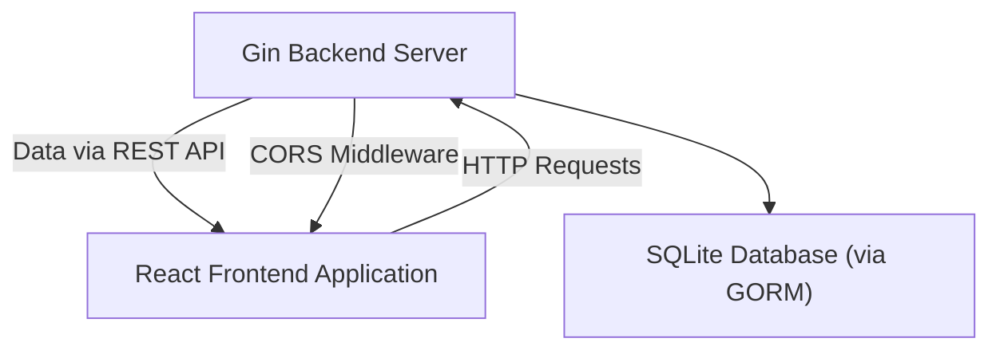

# Development Guidelines

This guide provides best practices and recommendations to help you effectively develop, maintain, and extend the Futuristic Todo App. It covers backend and frontend development, integration points, dependency management, and architectural considerations to ensure scalable and maintainable code.

---

## Table of Contents

- [Overview](#overview)
- [Backend Development](#backend-development)
  - [Project Structure and Key Components](#project-structure-and-key-components)
  - [Database and ORM Usage](#database-and-orm-usage)
  - [API Endpoint Design](#api-endpoint-design)
  - [Middleware and CORS](#middleware-and-cors)
- [Frontend Development](#frontend-development)
  - [React Component Structure](#react-component-structure)
  - [State and Effects](#state-and-effects)
  - [API Integration](#api-integration)
  - [Styling and Animation](#styling-and-animation)
- [Integration and System Touchpoints](#integration-and-system-touchpoints)
- [Tips and Best Practices](#tips-and-best-practices)

---

## Overview

The Futuristic Todo App is designed as a full-stack application with a Go-based backend using the Gin framework and GORM ORM, alongside a React frontend using hooks and axios for API communication. This guide details how to follow established patterns in both backend and frontend development to maintain consistency, reliability, and scalability.


---

## Backend Development

### Project Structure and Key Components

- The main backend entrypoint is `main.go` which:
  - Sets up the HTTP server with Gin.
  - Connects and configures the SQLite database using GORM.
  - Automatically migrates the `Todo` model schema.
  - Implements CORS to enable frontend-backend communication.
  - Defines RESTful API routes for todo management.

- The Todo model embeds `gorm.Model` providing standard fields such as ID and timestamps.

See the source: [`main.go`](/main.go)


### Database and ORM Usage

- Use GORM's `gorm.Open` with the SQLite driver for the database connection.
- Call `AutoMigrate` with the `Todo` struct to create/update the database schema.
- Perform CRUD operations using GORM methods like `.Find()`, `.Create()`, and `.Delete()`.

```go
// Connect to SQLite and migrate schema
 db, err := gorm.Open(sqlite.Open("todos.db"), &gorm.Config{})
 if err != nil {
     log.Fatal("failed to connect database")
 }
 err = db.AutoMigrate(&models.Todo{})
```

- Use safe error handling for database operations to avoid runtime panics.

### API Endpoint Design

- Provide RESTful endpoints under `/api/todos`:
  - `GET /api/todos` - Retrieve all todos.
  - `POST /api/todos` - Create a new todo. Bind input JSON with `ShouldBindJSON`.
  - `DELETE /api/todos/:id` - Delete a todo by ID.

Example endpoint handler:

```go
// POST /api/todos
r.POST("/api/todos", func(c *gin.Context) {
    var todo models.Todo
    if err := c.ShouldBindJSON(&todo); err != nil {
        c.JSON(http.StatusBadRequest, gin.H{"error": err.Error()})
        return
    }
    db.Create(&todo)
    c.JSON(http.StatusCreated, todo)
})
```

### Middleware and CORS

- Use `github.com/gin-contrib/cors` to configure and enable CORS middleware allowing frontend requests.

```go
config := cors.DefaultConfig()
config.AllowAllOrigins = true
r.Use(cors.New(config))
```

---

## Frontend Development

### React Component Structure

- The main app component (`App.jsx`) manages todo state and renders the UI.
- Use hooks (`useState`, `useEffect`) for state management and lifecycle.

```jsx
const [todos, setTodos] = useState([]);
useEffect(() => {
  fetchTodos();
}, []);
```

### State and Effects

- Fetch todos on component mount and update state.
- Handle addition and deletion via form submission and button events.

### API Integration

- Use `axios` for API calls to the backend endpoints.

```jsx
// Fetch todos
const fetchTodos = async () => {
  const res = await axios.get('/api/todos');
  setTodos(res.data);
};

// Add a new todo
const addTodo = async (e) => {
  e.preventDefault();
  await axios.post('/api/todos', { title: newTodo });
  fetchTodos();
};
```

### Styling and Animation

- Use Tailwind CSS for styling.
- Leverage `framer-motion` for smooth UI animations on todo items.

See the relevant files: [`frontend/src/App.jsx`](/frontend/src/App.jsx), [`frontend/tailwind.config.js`](/frontend/tailwind.config.js)

---

## Integration and System Touchpoints



- Backend exposes HTTP JSON API endpoints.
- Frontend consumes APIs via axios, maintaining sync with server state.
- Middleware ensures safe cross-origin requests.
- Both layers should handle errors gracefully and validate input.

---

## Tips and Best Practices

<AccordionGroup title="Code Quality and Practices">
<Accordion title="Backend">
- Modularize handlers if app grows.
- Validate inputs rigorously.
- Use environment variables for configs (e.g., DB path, ports).
- Properly handle errors and return meaningful HTTP status codes.
</Accordion>
<Accordion title="Frontend">
- Decouple API logic from UI components if complexity grows.
- Manage global state carefully if expanding (consider context or state libs).
- Keep UI responsive with loading and error states.
- Write unit and integration tests where feasible.
</Accordion>
</AccordionGroup>

<Check>
Always keep backend and frontend API contracts aligned to avoid integration issues.
</Check>

---

This document complements specific file documentation such as [`main.go`](/main.go) and [`frontend/src/App.jsx`](/frontend/src/App.jsx) to provide a holistic approach to development within this project.
