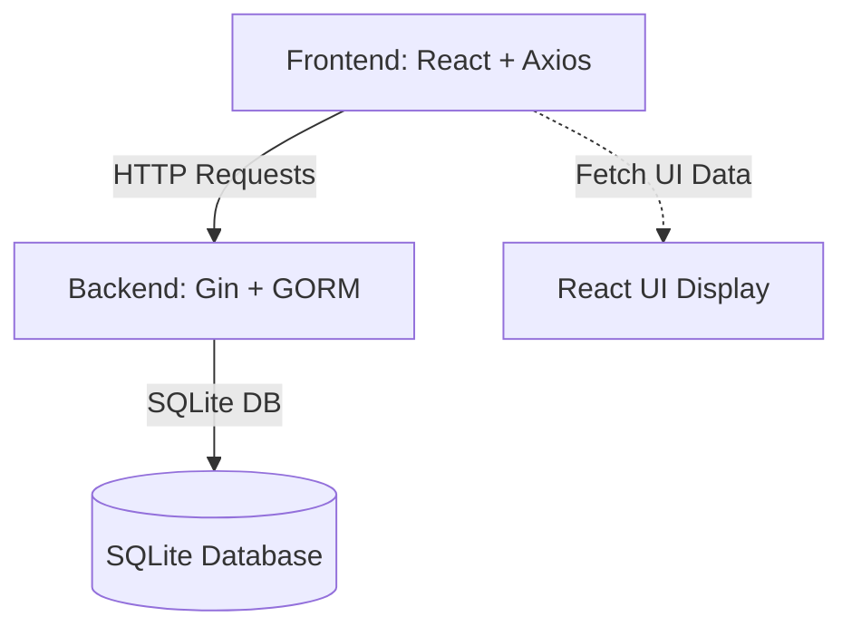

# Prerequisites

Before setting up and running the Futuristic Todo App, ensure your development environment meets the following prerequisites. These include required software, libraries, and tools necessary to build both the backend server and the React frontend.

---

## Table of Contents

- [Backend Prerequisites](#backend-prerequisites)
- [Frontend Prerequisites](#frontend-prerequisites)
- [General System Requirements](#general-system-requirements)

---

## Backend Prerequisites

The backend of the Todo app is implemented in Go using the Gin web framework and the GORM ORM. It interfaces with an SQLite database for persistence.

### Required Software & Libraries

- **Go programming language** (version 1.18+ recommended)
  - Provides the runtime and toolchain to build and execute the backend server.

- **Go Modules** for dependency management
  - Used to manage external libraries like Gin, GORM, and SQLite driver.

- **Go Packages** dependencies:
  - [github.com/gin-gonic/gin](https://github.com/gin-gonic/gin): HTTP web framework.
  - [gorm.io/gorm](https://gorm.io/): ORM for Golang to interact with the database.
  - [gorm.io/driver/sqlite](https://gorm.io/docs/driver_sqli.html): SQLite database driver.
  - [github.com/gin-contrib/cors](https://github.com/gin-contrib/cors): Middleware to handle CORS policies.

### Installation Example

```bash
# Install Go (if not already)
# Check version
go version

# Initialize Go module (if starting fresh)
go mod init todo-app

# Get dependencies
# Gin web framework
go get -u github.com/gin-gonic/gin

# GORM ORM and SQLite Driver
go get -u gorm.io/gorm gorm.io/driver/sqlite

# CORS middleware
 go get -u github.com/gin-contrib/cors
```

### Database

- **SQLite** is used as an embedded database; no separate installation necessary beyond the driver.
- The backend will create and auto-migrate the `todos` table automatically when run.

[See backend source file for usage and integration details](main.go)

---

## Frontend Prerequisites

The frontend is built with React, utilizing Tailwind CSS for styling and Axios for API communication.

### Required Software & Libraries

- **Node.js** (version 16+ recommended)
  - Required to run the frontend development server and build tools.

- **npm** or **yarn** package manager
  - To install project dependencies and run scripts.

- **Key npm Packages**:
  - `react` and `react-dom`: Core React libraries.
  - `axios`: For handling HTTP requests to the backend API.
  - `framer-motion`: For UI animation effects.
  - `tailwindcss`: Utility-first CSS framework.
  - `postcss` and `autoprefixer`: Tailwind CSS build tools.

### Installation Example

```bash
# Check node and npm versions
node -v
npm -v

# Install dependencies
npm install

# If manually setting up:
npm install react react-dom axios framer-motion tailwindcss postcss autoprefixer

# Initialize Tailwind CSS config (if not already)
npx tailwindcss init -p
```

### Frontend Build & Run

- The React app entry point is under `/frontend/src/main.jsx`.
- Use `npm start` for development or `npm run build` for production build.

[See frontend source entry point](frontend/src/main.jsx)

---

## General System Requirements

- **Operating System**: Linux, macOS, or Windows (with WSL for best compatibility on Windows).
- **Network Access**: Required for API communication between frontend and backend (usually localhost during development).
- **Ports**: Backend listens on port 8080 by default.

---

## Integration Overview

The backend and frontend are partially decoupled:

- Backend exposes REST API endpoints for todo management:
  - `GET /api/todos` 
  - `POST /api/todos`
  - `DELETE /api/todos/:id`

- Frontend communicates to backend via HTTP requests through Axios.
- CORS middleware in backend allows frontend origin.



---

<Check>Make sure your environment matches these prerequisites before proceeding to backend or frontend setup to avoid common errors.</Check>