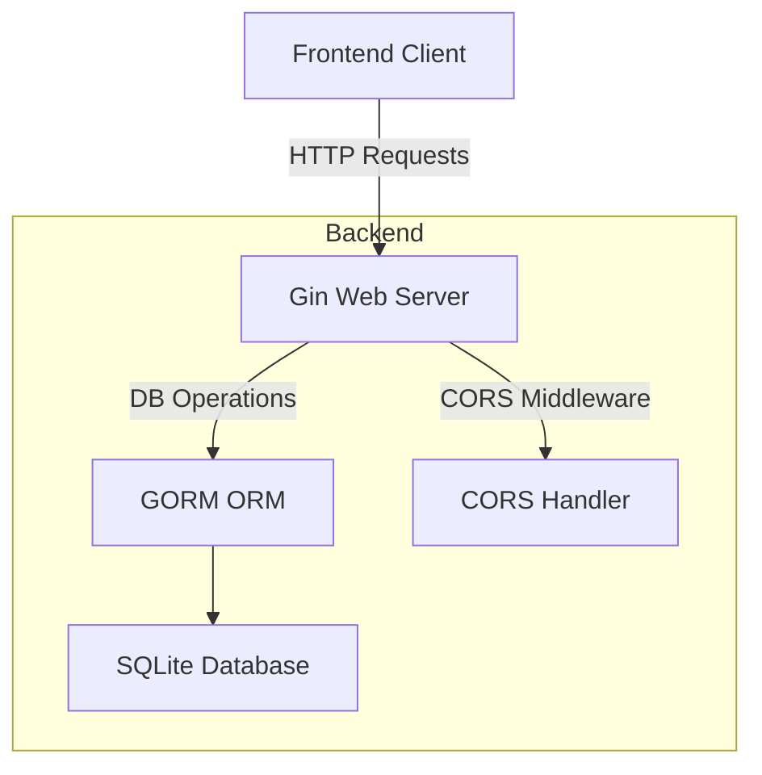

# Backend Setup

This section guides you through setting up the backend server for the Todo application. The backend is built with the Gin web framework and uses GORM for database operations. It exposes RESTful API endpoints allowing clients to create, read, and delete todo items stored in an SQLite database.

---

## Table of Contents
- [Overview](#overview)
- [Getting Started](#getting-started)
- [Database Setup](#database-setup)
- [API Endpoints](#api-endpoints)
- [Integration and Dependencies](#integration-and-dependencies)
- [Architecture Diagram](#architecture-diagram)

---

## Overview

The backend server is responsible for:

- Connecting to a persistent SQLite database.
- Auto-migrating the `Todo` model schema.
- Managing CORS middleware to enable safe cross-origin requests.
- Providing CRUD API endpoints for todo items.
- Running an HTTP server listening on port 8080.

This setup ensures a clean separation of concerns with a scalable architecture ready for frontend consumption.

---

## Getting Started

First, ensure you have Go installed and your environment set up. The project uses several Go packages:

- `github.com/gin-gonic/gin` - HTTP web framework.
- `gorm.io/gorm` & `gorm.io/driver/sqlite` - ORM and SQLite driver.
- `github.com/gin-contrib/cors` - Middleware handling CORS.

### Example: Basic server initialization with database connection

```go
package main

import (
    "log"
    "todos-app/models"

    "github.com/gin-contrib/cors"
    "github.com/gin-gonic/gin"
    "gorm.io/driver/sqlite"
    "gorm.io/gorm"
)

func main() {
    // Open connection to SQLite database
    db, err := gorm.Open(sqlite.Open("todos.db"), &gorm.Config{})
    if err != nil {
        log.Fatal("Failed to connect database: ", err)
    }

    // Auto migrate the Todo model
    if err := db.AutoMigrate(&models.Todo{}); err != nil {
        log.Fatal("AutoMigration failed: ", err)
    }

    // Create Gin router
    r := gin.Default()

    // Configure CORS middleware
    config := cors.DefaultConfig()
    config.AllowAllOrigins = true  // Allow all origins for simplicity
    r.Use(cors.New(config))

    // Define routes here

    // Start HTTP server
    if err := r.Run(":8080"); err != nil {
        log.Fatal("Failed to run server: ", err)
    }
}
```

---

## Database Setup

The database integration is handled by GORM using SQLite. The `Todo` model (defined in `todos-app/models`) extends `gorm.Model` which provides fields like ID, timestamps, etc.

When the server starts, it runs `db.AutoMigrate(&models.Todo{})` to ensure the database schema matches the `Todo` model.

This abstraction lets you seamlessly interact with the database using ORM methods without manual SQL.

---

## API Endpoints

The backend exposes three main RESTful API endpoints under `/api/todos`:

### 1. Retrieve Todos - `GET /api/todos`

Returns all todo items stored in the database.

```go
r.GET("/api/todos", func(c *gin.Context) {
    var todos []models.Todo
    db.Find(&todos)  // Fetch all todos
    c.JSON(200, todos)  // Return as JSON response
})
```

### 2. Create Todo - `POST /api/todos`

Accepts a JSON payload to create a new todo.

```go
r.POST("/api/todos", func(c *gin.Context) {
    var todo models.Todo
    if err := c.ShouldBindJSON(&todo); err != nil {  // Bind incoming JSON
        c.JSON(400, gin.H{"error": err.Error()})
        return
    }
    db.Create(&todo)  // Insert new todo              
    c.JSON(201, todo)  // Return created todo
})
```

### 3. Delete Todo - `DELETE /api/todos/:id`

Deletes a todo item by its ID.

```go
r.DELETE("/api/todos/:id", func(c *gin.Context) {
    id := c.Param("id")
    db.Delete(&models.Todo{}, id)  // Delete todo by ID
    c.JSON(204, nil)  // No content response
})
```

Each handler uses Gin's context and GORM's methods to manage data and respond accordingly.

---

## Integration and Dependencies

The backend integrates the following components:

- **GORM ORM**: Handles database connection, schema migration, and CRUD operations.
- **Gin Framework**: Manages routing, middleware, and HTTP request lifecycle.
- **CORS Middleware**: Enables cross-origin requests to allow the frontend to communicate with the backend securely.

### Interaction Pattern

- Client (frontend) sends HTTP requests to backend endpoints.
- Gin routes requests to matching handlers.
- Handlers execute database operations via GORM.
- Responses are returned as JSON objects.

This clear separation aids in modularity and maintainability.

---

## Architecture Diagram



This diagram shows the core components and data flow in the backend architecture.

---

## Further Reading

- [Backend source file `main.go`](main.go)
- [Todo model definition](todos-app/models)

---

<Info>
This backend setup provides a lightweight but robust foundation for the Todo app, enabling rapid API development and integration with modern frontend frameworks.
</Info>
