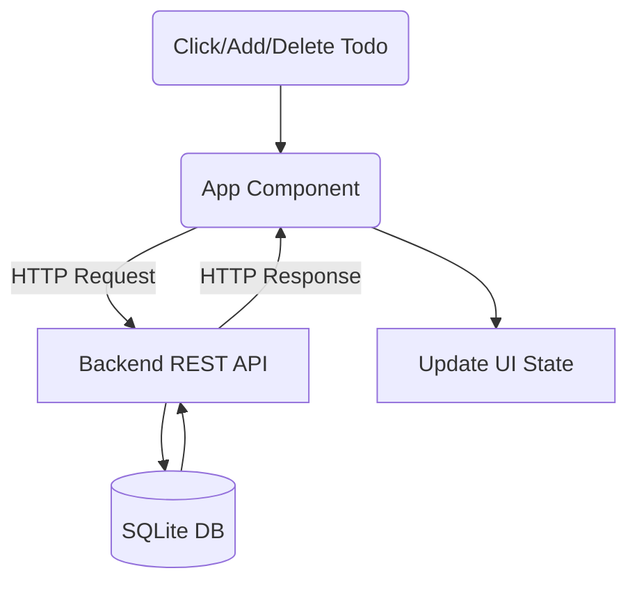

# Frontend Setup

This guide explains how to set up the frontend of the Futuristic Todo App. The frontend is built with React and styled with Tailwind CSS, connecting to the backend REST API to manage todo items. This setup covers bootstrapping the React app, integrating styles, and essential project configurations.

---

## Table of Contents

- [Prerequisites](#prerequisites)
- [Project Structure](#project-structure)
- [Setting Up React](#setting-up-react)
- [Styling with Tailwind CSS](#styling-with-tailwind-css)
- [Key Frontend Components](#key-frontend-components)
- [Integration with Backend API](#integration-with-backend-api)
- [Running the Frontend](#running-the-frontend)

---

## Prerequisites

Before setting up the frontend, ensure you have the following installed:

- Node.js (v16+ recommended)
- npm or yarn package manager

These are necessary to install dependencies and run the React development server.

---

## Project Structure

The frontend source is organized as follows:

```plaintext
frontend/
├── public/
│   └── index.html         # Root HTML entry point
├── src/
│   ├── main.jsx           # React app entry point
│   ├── App.jsx            # Main React component with todo logic
│   ├── index.css          # Global CSS and Tailwind imports
│   └── ...                # Other React components and assets
├── tailwind.config.js     # Tailwind CSS configuration
└── postcss.config.js      # PostCSS config for Tailwind and autoprefixer
```

- The `index.html` bootstraps React into a root container.
- `main.jsx` mounts the React `App` component.
- `App.jsx` manages fetching, adding, and deleting todos.

---

## Setting Up React

The React application is bootstrapped via `main.jsx`:

```jsx
// src/main.jsx
import React from 'react';
import ReactDOM from 'react-dom/client';
import App from './App';
import './index.css';

const container = document.getElementById('root');
const root = ReactDOM.createRoot(container);

// StrictMode helps highlight potential problems
root.render(
  <React.StrictMode>
    <App />
  </React.StrictMode>
);
```

This file:
- Imports React and ReactDOM's client API.
- Imports the main `App` component and global styles.
- Creates a React root and renders the app inside the root DOM node.

---

## Styling with Tailwind CSS

The app uses Tailwind CSS for utility-first styling.

### Configuration Highlights

```js
// tailwind.config.js
module.exports = {
  content: ['./src/**/*.{js,jsx,ts,tsx}'], // Files to scan for classes
  theme: {
    extend: {
      colors: {
        primary: '#4f46e5',
        accent: '#ec4899',
      },
      animation: {
        gradient: 'gradient 15s ease infinite',
      },
      keyframes: {
        gradient: {
          '0%, 100%': { 'background-position': '0% 50%' },
          '50%': { 'background-position': '100% 50%' },
        },
      },
    },
  },
  plugins: [],
};
```

This config:
- Scans `src` files for Tailwind classes.
- Adds custom colors and a smooth background gradient animation.

### Global Styles

```css
/* src/index.css */
@tailwind base;
@tailwind components;
@tailwind utilities;

body {
  font-family: 'Inter', sans-serif;
  background: linear-gradient(270deg, #4f46e5, #ec4899, #f59e0b);
  background-size: 600% 600%;
  animation: gradient 15s ease infinite;
}
```

This file imports Tailwind's core styles and setups the animated gradient background.

---

## Key Frontend Components

### `App.jsx`
- Manages state for todos and new todo input.
- Fetches todos from backend on mount.
- Handles adding and deleting todos with API calls.

```jsx
import React, { useState, useEffect } from 'react';
import axios from 'axios';

export default function App() {
  const [todos, setTodos] = useState([]);
  const [newTodo, setNewTodo] = useState('');

  // Fetch todos from backend
  useEffect(() => {
    async function fetchTodos() {
      const response = await axios.get('/api/todos');
      setTodos(response.data);
    }
    fetchTodos();
  }, []);

  // Add a new todo
  async function addTodo(e) {
    e.preventDefault();
    if (!newTodo.trim()) return;
    const response = await axios.post('/api/todos', { title: newTodo });
    setTodos([...todos, response.data]);
    setNewTodo('');
  }

  // Delete a todo
  async function deleteTodo(id) {
    await axios.delete(`/api/todos/${id}`);
    setTodos(todos.filter(t => t.id !== id));
  }

  // JSX render omitted for brevity
  return (/* UI Components */);
}
```

This demonstrates interaction with the backend API and common state management patterns.

---

## Integration with Backend API

The frontend interacts with backend endpoints:

- `GET /api/todos` — Fetch all todos
- `POST /api/todos` — Add a new todo (JSON with `{ title }`)
- `DELETE /api/todos/:id` — Delete a todo by ID

These requests are handled asynchronously using `axios` for HTTP.

<Accordion title="API Interaction Sequence">

</Accordion>

---

## Running the Frontend

### Install dependencies

```bash
cd frontend
npm install
```

### Start development server

```bash
npm start
```

This will start a React development server, typically accessible at `http://localhost:3000`. The frontend is now connected to the backend API on port 8080 for todo operations.

---

For detailed backend API contract and endpoints, see [Backend Setup](/docs/Getting%20Started/Backend%20Setup).

For full source, visit:

- [`frontend/index.html`](frontend/index.html)
- [`frontend/src/main.jsx`](frontend/src/main.jsx)
- [`frontend/src/App.jsx`](frontend/src/App.jsx)
- [`frontend/tailwind.config.js`](frontend/tailwind.config.js)
- [`frontend/src/index.css`](frontend/src/index.css)
