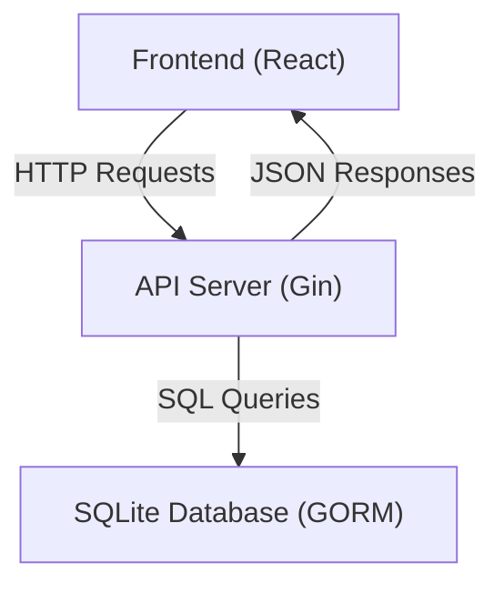

# API Usage Examples

This section provides practical examples demonstrating how to interact with the Todos backend API. The endpoints enable fetching, adding, deleting, and reordering todos for a seamless integration between your frontend client and the server.

---

## Table of Contents

- [Fetching Todos](#fetching-todos)
- [Adding a Todo](#adding-a-todo)
- [Deleting a Todo](#deleting-a-todo)
- [Reordering Todos](#reordering-todos)
- [Integration Overview](#integration-overview)

---

## Fetching Todos

Retrieve the full list of todos in ascending order by their sequence.

### Example Request

```js
import axios from "axios";

async function fetchTodos() {
  try {
    const response = await axios.get("/api/todos");
    console.log(response.data); // Array of todo objects
  } catch (error) {
    console.error("Failed to fetch todos", error);
  }
}

fetchTodos();
```

### Description
- Sends a **GET** request to `/api/todos`.
- Returns an array of todos, each containing fields like `id`, `title`, `completed`, and `order`.

---

## Adding a Todo

Create a new todo item with a title. The server assigns the todo an order value automatically.

### Example Request

```js
import axios from "axios";

async function addTodo(title) {
  try {
    const response = await axios.post("/api/todos", { title });
    console.log("Created todo:", response.data);
  } catch (error) {
    console.error("Failed to add todo", error);
  }
}

addTodo("Learn Mintlify API Usage");
```

### Description
- Sends a **POST** request to `/api/todos` with a JSON body containing a `title` string.
- Server responds with the created todo object including its assigned `id` and `order`.

---

## Deleting a Todo

Remove a todo item by its unique ID.

### Example Request

```js
import axios from "axios";

async function deleteTodo(id) {
  try {
    await axios.delete(`/api/todos/${id}`);
    console.log(`Deleted todo with id ${id}`);
  } catch (error) {
    console.error("Failed to delete todo", error);
  }
}

// Example usage:
deleteTodo(3);
```

### Description
- Sends a **DELETE** request to `/api/todos/{id}` where `{id}` is the todo's identifier.
- Server deletes the todo if it exists.

---

## Reordering Todos

Update the order of todos after user rearrangement in the frontend.

### Example Request

```js
import axios from "axios";

async function reorderTodos(todoIds) {
  try {
    /*
     * todoIds: an array of todo IDs arranged in the new order
     * Example: [5, 2, 1, 4, 3]
     */
    await axios.put("/api/todos/reorder", { todo_ids: todoIds });
    console.log("Reordered todos successfully");
  } catch (error) {
    console.error("Failed to reorder todos", error);
  }
}

// Example call:
reorderTodos([5, 2, 1, 4, 3]);
```

### Description
- Sends a **PUT** request to `/api/todos/reorder` with JSON body:
  - `todo_ids`: an array of todo IDs representing the desired order.
- The server updates the `order` attribute of each todo accordingly.

---

## Integration Overview

The Todos API is backed by a Go server using Gin for HTTP routing and GORM with SQLite for persistence. All endpoints return JSON-formatted data and accept JSON bodies where applicable. CORS is enabled to allow frontend clients such as React apps to interact seamlessly.

### System Touchpoints




### Core Dependencies

- **Gin**: HTTP framework routing requests and handling middleware.
- **GORM**: ORM for modeling and querying the SQLite database.
- **CORS Middleware**: Ensures cross-origin requests from frontend are permitted.

### How to Integrate

1. Use standard HTTP client libraries (e.g., `axios`, `fetch`) from your frontend.
2. Communicate with these endpoints according to the examples.
3. Handle responses and errors appropriately to provide user feedback.

---

## Additional Resources

- See backend implementation in [main.go](/main.go) for detailed API behavior.
- Frontend API consumption example at [src/App.jsx](/frontend/src/App.jsx).

<AccordionGroup title="Quick Tips">
<Accordion title="Handle API Errors">
Always include error handling (try–catch or `.catch()` in promises) to handle network failures or server errors gracefully.
</Accordion>
<Accordion title="Keep Order Consistent">
After reordering todos, refresh the local list or update state to reflect new orders returned from the server.
</Accordion>
<Accordion title="Use Unique IDs">
Todo IDs are unique numeric identifiers; use them consistently when referencing todos in requests.
</Accordion>
</AccordionGroup>
