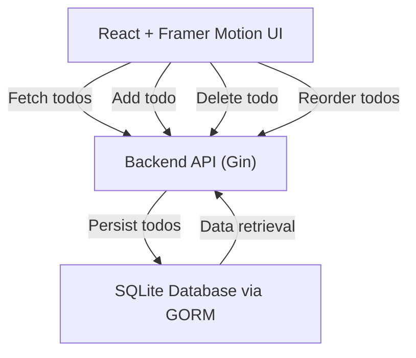

# User Interface Usage

This guide explains how to interact with the Todo application's user interface (UI). It covers the core features — viewing, adding, deleting, and reordering tasks — and illustrates how these operations integrate with the backend API. The frontend is implemented using React with Framer Motion for reordering animations, providing a smooth and intuitive user experience.

---

## Table of Contents

- [Overview](#overview)
- [Viewing Todos](#viewing-todos)
- [Adding a Todo](#adding-a-todo)
- [Deleting a Todo](#deleting-a-todo)
- [Reordering Todos](#reordering-todos)
- [Integration with Backend](#integration-with-backend)
- [Dependencies and Libraries](#dependencies-and-libraries)

---

## Overview

The UI provides a dynamic, interactive todo list where users can:

- See all their current todos, sorted by order.
- Add new todos via a form input.
- Delete existing todos using delete buttons.
- Reorder todos by dragging and dropping.

Changes are persisted by communicating with the backend REST API. The frontend leverages React's state management and lifecycle hooks, combined with the Framer Motion library to enable smooth, draggable reorder functionality.


## Viewing Todos

The UI initially fetches all todo items from the backend and renders them sorted by their order.

### How it works:

1. When the component mounts, it sends a GET request to `/api/todos`.
2. The response contains the todos array sorted by ascending order.
3. Todos are stored in component state and displayed in a list.

```jsx
useEffect(() => {
  axios.get('/api/todos').then((response) => {
    setTodos(response.data)
  })
}, [])

// Rendering example
return todos.map(todo => (
  <div key={todo.id}>{todo.title}</div>
))
```

---

## Adding a Todo

Users can add new todos by typing into an input and submitting the form.

### Process:

1. User enters a title in the input field.
2. On form submit, send a POST request to `/api/todos` with the new todo title in JSON.
3. The backend assigns the next order and adds the todo.
4. UI updates the local todos state to include the new item.

```jsx
const addTodo = async (e) => {
  e.preventDefault()
  if (!newTodo.trim()) return

  const response = await axios.post('/api/todos', { title: newTodo })
  setTodos([...todos, response.data])
  setNewTodo('')
}

<form onSubmit={addTodo}>
  <input
    value={newTodo}
    onChange={e => setNewTodo(e.target.value)}
    placeholder="Add a new todo"
  />
  <button type="submit">Add</button>
</form>
```

---

## Deleting a Todo

Each todo item has a delete button to remove it.

### Workflow:

1. User clicks delete for a todo.
2. Sends a DELETE request to `/api/todos/{id}`.
3. On success, the todo is removed from UI state.

```jsx
const deleteTodo = async (id) => {
  await axios.delete(`/api/todos/${id}`)
  setTodos(todos.filter(todo => todo.id !== id))
}

// UI example in todo render
<button onClick={() => deleteTodo(todo.id)}>Delete</button>
```

---

## Reordering Todos

Todos can be reordered by dragging and dropping, enabling custom prioritization.

### Mechanics:

- The UI uses Framer Motion's `Reorder.Group` and `Reorder.Item` components to handle drag and drop.
- When the order changes, the new array is sent with a PUT request to `/api/todos/reorder` containing the updated todo IDs.
- Backend updates each todo's order attribute to persist the new sequence.
- The UI updates the state to reflect the new order.

```jsx
const handleReorder = async (newTodos) => {
  setTodos(newTodos)
  const todoIDs = newTodos.map(todo => todo.id)
  await axios.put('/api/todos/reorder', { todoIDs })
}

return (
  <Reorder.Group axis="y" values={todos} onReorder={handleReorder}>
    {todos.map(todo => (
      <Reorder.Item key={todo.id} value={todo}>
        {todo.title}
      </Reorder.Item>
    ))}
  </Reorder.Group>
)
```

---

## Integration with Backend

The UI fully integrates with the backend REST API built with Gin and GORM. Key touchpoints:

- **Fetch Todos:** GET `/api/todos` returns JSON array ordered by `order` ascending.
- **Add Todo:** POST `/api/todos` accepts JSON `{ title: string }`, returns created todo with order.
- **Delete Todo:** DELETE `/api/todos/{id}` removes todo by id.
- **Reorder Todos:** PUT `/api/todos/reorder` accepts `{ todoIDs: uint[] }` to update orders.

Each operation triggers an HTTP request using Axios, handling responses and updating React state to keep UI data in sync with backend.

---

## Dependencies and Libraries

| Dependency     | Purpose                                                    |
|----------------|------------------------------------------------------------|
| React          | Main UI library managing component state and rendering.   |
| Axios          | HTTP client for REST API requests.                         |
| Framer Motion  | Provides animated drag-and-drop reorder support.           |
| Gin (Backend)  | REST API framework managing endpoints.                    |
| GORM (Backend) | ORM to persist todo data in SQLite with migration support. |

The frontend depends on seamless API integration to offer a responsive UI experience. Backend APIs conform to JSON standards and allow for real-time state updates.

---

## Architecture Overview



This flowchart illustrates how the frontend UI communicates with the backend API server, which in turn manages persistent storage of todo items.

---

## Related Source Files

- Backend server and REST API handling: [main.go](main.go)
- Frontend main UI component including UI logic: [frontend/src/App.jsx](frontend/src/App.jsx)
- Frontend ReactDOM entry point: [frontend/src/main.jsx](frontend/src/main.jsx)

---

For detailed API information, see the [API Usage Examples](API%20Usage%20Examples) documentation.

---

<Info>
Remember to keep your frontend dependencies up to date to leverage improvements in React, Framer Motion, and Axios.
</Info>
